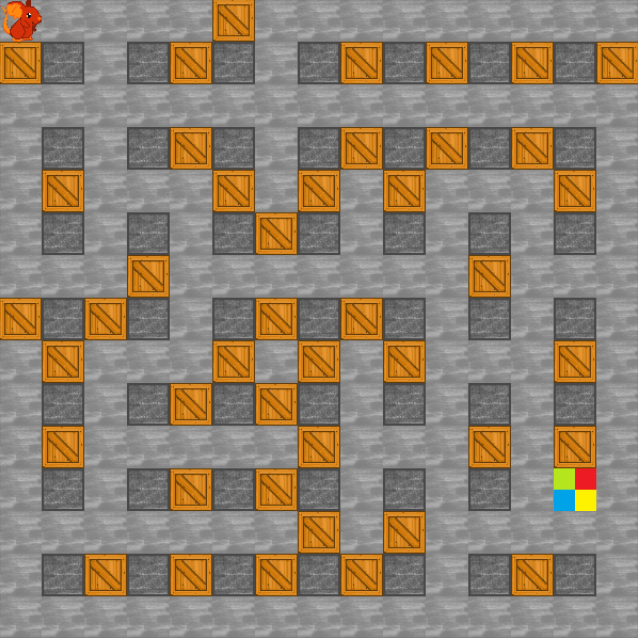
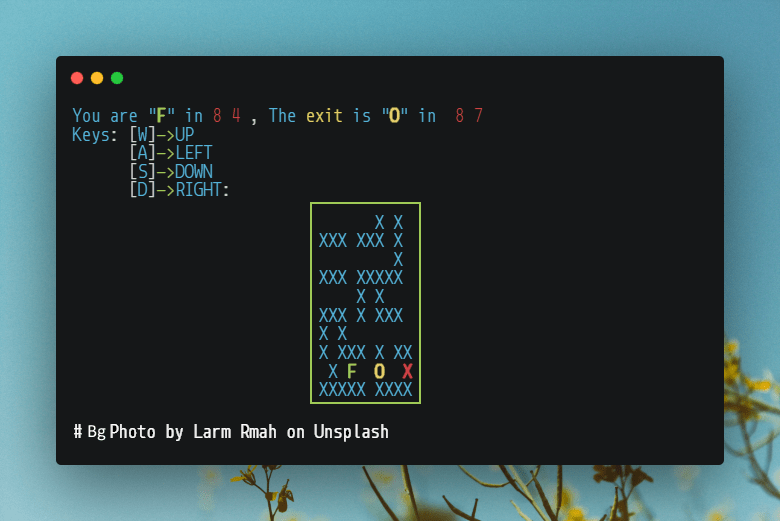
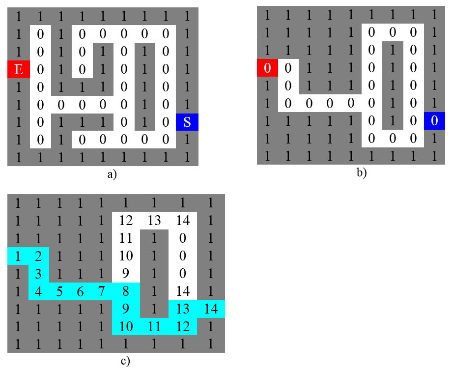
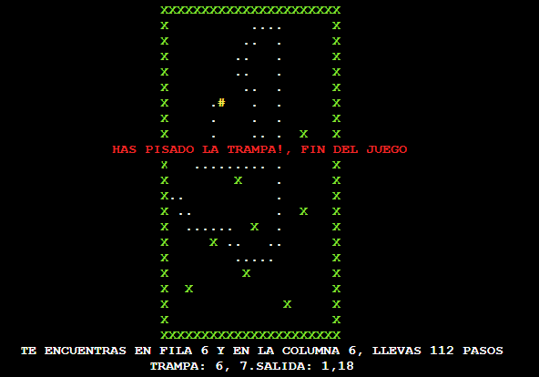
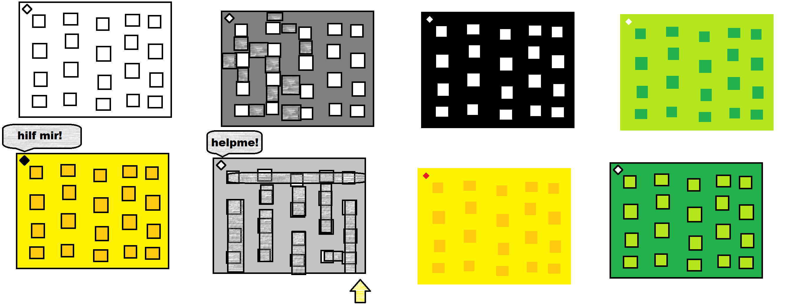
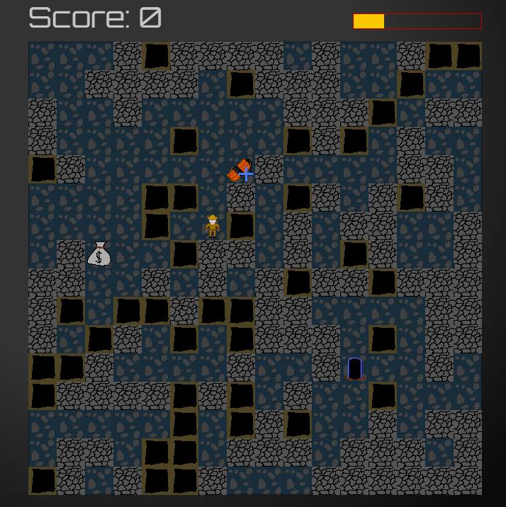

<p align="center">
  <a href="https://marfullsen.github.io/Escurridizo-the-game/" rel="noopener">
 </a>
</p>

<h3 align="center">Escurridizo, la ratita de Dagoberto</h3>

<div align="center">

[](https://github.com/ripexz/dungeon-treasure-hunt)
[](https://github.com/Marfullsen/hybrid-collage/blob/master/game-escurridizo.pas)
[](https://marfullsen.github.io/Escurridizo-the-game/)
[](/LICENSE.txt)

</div>

<p align="center">Escurridizo es un videojuego sobre una ratita que escapa de un laberinto.
    <br> 
</p>

## 📝 Contenidos

- [Sobre el juego](#about)
- [Fases](#getting_started)
- [Desarrollo](#deployment)
- [¿Cómo se juega?](#usage)
- [Tecnologías usadas](#built_using)
- [Autores](#authors)
- [Agradecimientos](#acknowledgement)

## 🧐 Sobre el juego <a name = "about"></a>

Escurridizo fue un problema planteado para el segundo certamen de la asignatura **Fundamentos de Programación**, en la Universidad Técnica Federico Santa María. El problema planteado se basa en un ratoncito atrapado en un laberinto dentro del cuál hay un queso, una trampa y una salida. El certamen constaba de 90 minutos para realizar **un código escrito a mano** en una hoja cuadriculada usando el lenguaje de programación **Pascal** o Pseudo-Lenguaje.

<p align="center">
  <a href="https://marfullsen.github.io/Escurridizo-the-game/" rel="noopener">
 </a>
</p>

Una vez terminado el certamen, me dispuse a realizar un algoritmo que creara una matriz para un laberinto que siempre fuera distinto, a ese código le llamé **motor para crear laberintos al azar**. Escribí el código del motor en lenguaje **Python** e hice la adaptación para que funcionara en JavaScript, logrando así reemplazar _el motor lógico_ al código del juego [Dungeon Treasure Hunt](https://github.com/ripexz/dungeon-treasure-hunt) escrito por [ripexz](https://github.com/ripexz/).

## 🏁 Fases <a name = "getting_started"></a>

El desarrollo del juego se divide en tres partes:
1. Realización del certamen escrito a mano con código en **Pascal**.
  - Una versión mejorada del código puede encontrarse en [hybrid-collage/game-escurridizo.pas](https://github.com/Marfullsen/hybrid-collage/blob/master/game-escurridizo.pas) y ejecutarse [online](https://www.onlinegdb.com/online_pascal_compiler) para disfrutar del juego.
2. Creación de un _motor lógico_ que genera laberintos aleatorios escrito con **Python**.
  - Una versión muy rústica puede ser encontrada aqui en [laberinto_a_puntos.py](./docs/code/laberinto_a_puntos.py)

<p align="center">
  <a href="./docs/code/laberinto_a_puntos.py" rel="noopener">
 </a>
</p>

3. Transcripción del _motor lógico_ al lenguaje JavaScript para reemplazar el motor de [Dungeon Treasure Hunt](https://github.com/ripexz/dungeon-treasure-hunt) y crear la versión definitiva de [Escurridizo](https://marfullsen.github.io/Escurridizo-the-game/).

## 🚀 Desarrollo <a name = "deployment"></a>

Los videojuegos de laberintos por lo general se basan en matrices bidimensionales, el desarrollo de este juego sigue la misma lógica.

<p align="center">
  <a href="./docs/code/logica-matrices.jpg" rel="noopener">
 </a>
</p>

### Lanzar el juego en un servidor local

Se recomienda levantar un servidor, aunque también funcionará ingresando directamente al archivo **index.html** con un navegador.

**Listado de servidores**
- [HTTP server](https://www.npmjs.com/package/http-server)
- [Live Server](https://marketplace.visualstudio.com/items?itemName=ritwickdey.LiveServer)

```
cd Escurridizo-the-game
http-server.cmd
```

Abrir [http://localhost:8080/](http://localhost:8080/) o [http://127.0.0.1:8080/](http://127.0.0.1:8080/) en el navegador.

## 🎈 ¿Cómo se juega? <a name="usage"></a>

Para jugar: 
- **Las flechas de dirección** para desplazamiento.
- Tecla **Espacio** para plantar una bomba.

<p align="center">
  <a href="./docs/code/bomb.png" rel="noopener">
 </a>
</p>

## ⛏️ Tecnologías usadas <a name = "built_using"></a>

### 🔧 Bosquejos
- [Pascal](https://www.freepascal.org/) - Lenguaje de programación

<p align="center">
  <a href="https://github.com/Marfullsen/hybrid-collage/blob/master/game-escurridizo.pas" rel="noopener">
 </a>
</p>

- [Python](https://www.python.org/) - Lenguaje de programación
- [Vanilla JavaScript](https://www.javascript.com/) - Lenguaje de programación

### 🔧 De la bifurcación (del Fork).
- [Mdernizr](https://modernizr.com/) -  Biblioteca de JavaScript
- [Sizzle](https://sizzlejs.com/) - Motor de seleccionado rápido para jQuery.

## ✍️ Autores <a name = "authors"></a>

- [@Marfullsen](https://github.com/Marfullsen/) - Sketch for a Maze Game and deleloped a _logic motor_.

<p align="center">
  <a href="./docs/img/labyrinth-sketch.png" rel="noopener">
 </a>
</p>

### Bifurcado de (Forkeado de)
- [@ripexz](https://github.com/ripexz/) - Developed a Bomberman-like game.

<p align="center">
  <a href="https://ripexz.github.io/dungeon-treasure-hunt/" rel="noopener">
 </a>
</p>

## 🎉 Agradecumientos <a name = "acknowledgement"></a>

- [Dungeon Treasure Hunt](https://github.com/ripexz/dungeon-treasure-hunt) by [ripexz](https://github.com/ripexz/)
- [Mixkit Free-sound-effects](https://mixkit.co/free-sound-effects/)
- [Cuadrículas para dibujar en WORD desde cero](https://www.youtube.com/watch?v=Qfhf6i_Yjkc)
- [Unsplash photo](https://unsplash.com/photos/1cvEeuJKYto) by [Larm Rmah](https://unsplash.com/@larm)
- [Imágenes del código por Carbon](https://carbon.now.sh/)
- [Compresor de imágenes](https://compresspng.com/)