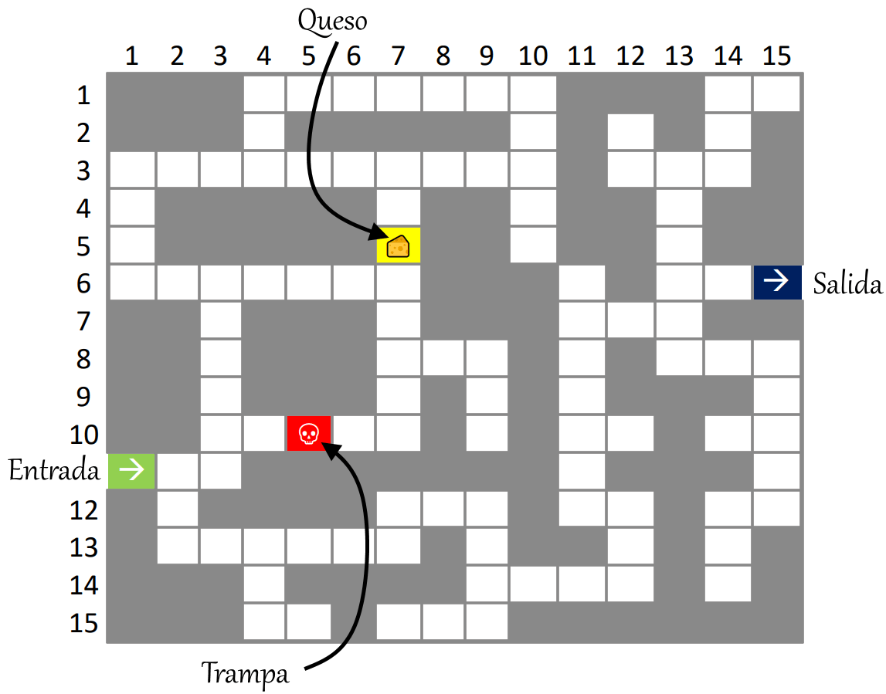

<p align="center">
  <a href="" rel="noopener">
 </a>
</p>

<h3 align="center">Escurridizo, la ratita de Dagoberto</h3>

<div align="center">


[](https://github.com/ripexz/dungeon-treasure-hunt)
[](https://github.com/kylelobo/The-Documentation-Compendium/issues)
[](https://github.com/kylelobo/The-Documentation-Compendium/pulls)
[](/LICENSE.txt)

</div>

<p align="center">Escurridizo es un videojuego sobre una ratita que escapa de un laberinto.
    <br> 
</p>

## 📝 Table of Contents

- [About](#about)
- [Getting Started](#getting_started)
- [Deployment](#deployment)
- [Usage](#usage)
- [Built Using](#built_using)
- [TODO](../TODO.md)
- [Contributing](../CONTRIBUTING.md)
- [Authors](#authors)
- [Acknowledgments](#acknowledgement)

## 🧐 About <a name = "about"></a>

Escurridizo fue un problema planteado para el segundo certamen de la asignatura **Fundamentos de Programación**, en la Universidad Técnica Federico Santa María. El problema planteado se basa en un ratoncito atrapado en un laberinto dentro del cuál hay un queso, una trampa y una salida. El certamen constaba de 90 minutos para realizar **un código escrito a mano** en una hoja cuadriculada usando el lenguaje de programación **Pascal** o Pseudo-Lenguaje.

## 🏁 Getting Started <a name = "getting_started"></a>

El desarrollo del juego se divide en tres partes:
1. Realización del certamen escrito con código en Pascal.
2. Transcripción, corrección y adaptación del código en Pascal hacia Python3
3. Inserción del código generador de laberintos dentro de algún otro juego similar, reemplazando "El motor".

Ver [Desarrollo](#deployment) para más información.

### Prerequisites

Se recomienda tener instalado Python3 para  ojear el motor inicial.

Para ver el motor funcionando con GUI, ir directamente a la página web.

```
Python
```

### Installing

A step by step series of examples that tell you how to get a development env running.

Say what the step will be

```
Give the example
```

And repeat

```
until finished
```

End with an example of getting some data out of the system or using it for a little demo.

## 🔧 Running the tests <a name = "tests"></a>

Explain how to run the automated tests for this system.

### Break down into end to end tests

Explain what these tests test and why

```
Give an example
```

### And coding style tests

Explain what these tests test and why

```
Give an example
```

## 🎈 Usage <a name="usage"></a>

Add notes about how to use the system.

## 🚀 Deployment <a name = "deployment"></a>

Add additional notes about how to deploy this on a live system.

## ⛏️ Built Using <a name = "built_using"></a>

### Sketch
- [Pascal](https://www.freepascal.org/) - Programming language
- [Python](https://www.python.org/) - Programming language

### From forked
- [Mdernizr](https://modernizr.com/) -  JavaScript library
- [Sizzle](https://sizzlejs.com/) - Hot Selector Engine.

## ✍️ Authors <a name = "authors"></a>

- [@Marfullsen](https://github.com/Marfullsen/) - Sketch for a Maze Game and adapted another game to finish the sketch.

### Forked from
- [@ripexz](https://github.com/ripexz/) - Developed a Bomberman-like game.

See also the list of [contributors](https://github.com/kylelobo/The-Documentation-Compendium/contributors) who participated in this project.

## 🎉 Acknowledgements <a name = "acknowledgement"></a>

- [Dungeon Treasure Hunt](https://github.com/ripexz/dungeon-treasure-hunt) by [ripexz](https://github.com/ripexz/)
- [Mixkit Free-sound-effects](https://mixkit.co/free-sound-effects/)
- [Cuadrículas para dibujar en WORD desde cero](https://www.youtube.com/watch?v=Qfhf6i_Yjkc)